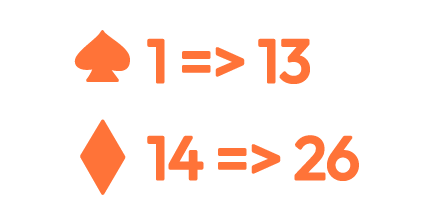

# Puzzle Game 
© Si Jia WANG

## Sommaire
*[Le cadre](#le-cadre)
*[Le site](#le-site)
*[Les Puzzles](#les-puzzles)
*[Utilisation de Wordpress, DIVI]($utilisation-de-wordpress,-divi)

## Le cadre
Réalisé pour le calendrier de l'avant de la promo AVMN 2021-2023!
Chaque membre de la promotion se charge au minimum d'un jour du calendrier.
L'outil mis à disposition à chacun est un dossier Google Drive partagé dans lequel chacun possède un Google Doc (pour saisir le texte) et un dossier "contenu" pour mettre des éléments tel que les photos.
Ce "site" est réalisé, pour le jour du 16 décembre 2021, dont je me charge.
Les éléments javascript, CSS et HTML sont regroupés en 1 seul [fichier](quiz.html) pour simplifier l'intégration de cette page au reste du calendrier. Le site contenant tous les jours du calendrier de l'avant n'est pas géré par moi. 

## Le site
Ce jeu est composé de 3 puzzles où les personnes peuvent répondre, en fonction des réponses des messages différents seront affichés.
Cette page intègre un petit compteur qui compterait les points gagnés lors des saisies de réponses justes. 
Les visuelles sont entièrement réalisé "manuellement" à l'aide d'Illustrator: 
- [Le puzzle 1](puzzle2.png) :
    
- [Le puzzle 2](puzzle1.png) :
    
- [Le puzzle 3](puzzle3.png) : 
    
- [l'indice 2](indice1.png) :
    
- [l'indice 3](indice3.png) :
    
- [Le favicon](favicon.png) :
    

## Les Puzzles
- Le premier puzzle se base sur des principes très simples. 
- Le deuxième est inspiré d'un puzzle de l'émission ["Who'The Murderer" saison 3, épisode du 20170922 vers 22:22](https://youtu.be/l_Ya9S2DJ3I?t=1342).
- Le troisième puzzle est un puzzle original bien que très basique (donc je pense qu'il existe déjà des puzzles similaires). 

## Utilisation de Wordpress, DIVI
Ce répertoire recense donc une version simplifiée à intégré dans le calendrier commun. En même temps, il a servi de brouillon/maquette pour refaire ce site sur Wordpress à l'aide de DIVI pour me familiariser avec ce dernier, étant donné que je n'ai jamais eu l'opportunité d'y toucher auparavant. La version Wordpress se retrouve à l'adresse suivante : [puzzle.wang-sijia.fr](https://puzzle.wang-sijia.fr/).